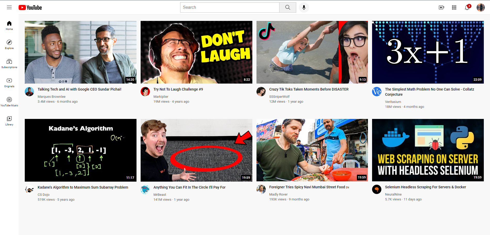

# YouTube Web Application 


Simple YouTube Web App written in HTML, CSS.

### Use of the Project:
This project provides a basic YouTube web app built with HTML and CSS. It's designed for learning purposes, showcasing fundamental web development concepts like hover effects, layouts, and using HTML elements effectively.  While it doesn't have real functionality, it serves as a helpful tool to practice and understand front-end development techniques.

### Used Technologies
- Front-end Languages:
  - HTML -> Used for structuring the content of the web page.
  - CSS3 -> Used for styling the layout and appearance of the web page elements.
- Concepts:
  - Hovers, Transitions, Shadows -> Techniques for adding visual effects and interactivity to web elements.
  - Chrome DevTools & CSS Box Model -> Tools and concepts for inspecting and manipulating the layout of web pages.
  - Display Property -> Controls how an HTML element is displayed (block, inline, etc.).
  - CSS Grid & Flexbox -> Layout systems for arranging elements on a web page.
  - Position Property -> Controls the positioning of elements relative to their normal position in the document flow.
  - Nested Layout Techniques -> Combining different layout methods to achieve complex layouts.
  - div element -> A generic HTML element used to represent a division or section of content.
  - CSS Specificity -> Rules for determining which CSS style applies to an element when multiple styles are defined.
  - Semantic HTML Elements -> Using HTML elements that describe their meaning (e.g., heading (h1), paragraph (p)).

### Steps to Use:
---

1. **Download or clone the repository**
   ```shell
   git clone https://github.com/Thadkapally-Saikiran/YouTube-Web-Application.git
   
  - Go to the directory
  - Run the index.html file
  - Start Exploring!!

### ScreenShots



### Project Structure:
 - Channel-pictures: Folder containing channel pictures
 - icons: Folder containing icons.
 - thumbnails: Folder containing thumbnails.
 - icons: Folder containing icons.
 - intro-to-html: Folder containing HTML introduction files.
 - flexbox.html: HTML file for Flexbox demonstration.
 - grid.html: HTML file for Grid demonstration.
 - position.html: HTML file for CSS positioning demonstration.
 - index.html: Main HTML File to execute
